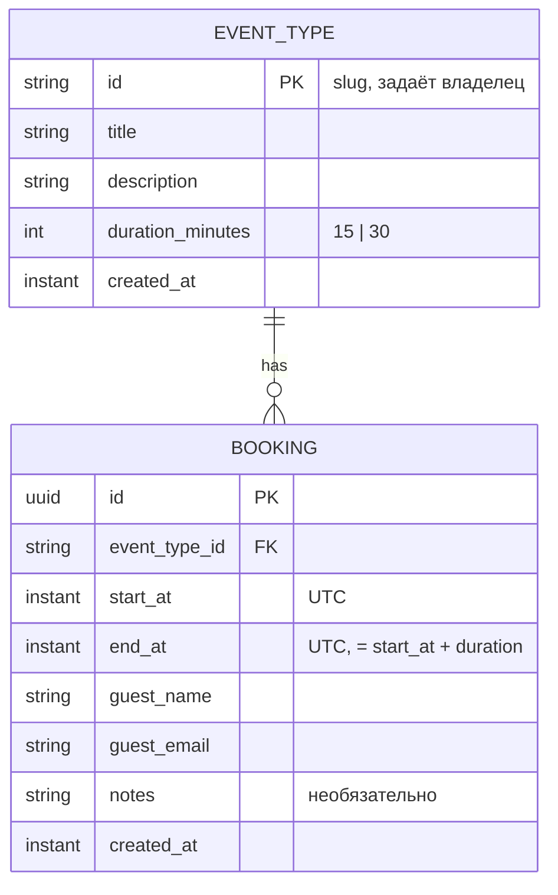
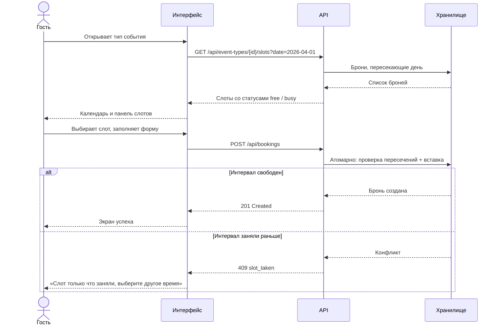
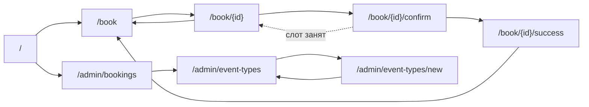

# Спецификация приложения «Запись на звонок»

Документ описывает внешнее поведение системы: поддерживаемые сценарии, доменную модель,
HTTP-контракт, правила валидации и критерии приёмки.

Спецификация намеренно не фиксирует язык, фреймворк, СУБД и структуру каталогов — эти решения
принимаются отдельно и не влияют на изложенные здесь требования.

Источники требований:

- [`project-description.md`](./project-description.md) — исходное описание задачи;
- [`01-home.png`](./01-home.png) — главная страница;
- [`02-book-catalog.png`](./02-book-catalog.png) — каталог типов событий;
- [`03-book-event-type.png`](./03-book-event-type.png) — выбор даты и слота.

---

## 1. Обзор

### 1.1. Назначение

«Запись на звонок» — упрощённый сервис бронирования времени по мотивам Cal.com. Владелец календаря
публикует типы встреч, гость выбирает удобный свободный слот в ближайшие 14 дней и оформляет запись.
Владелец видит список всех предстоящих встреч.

### 1.2. Границы объёма

В систему **не входят**:

- регистрация, вход, аутентификация и авторизация в любом виде;
- личные кабинеты и профили гостей;
- интеграции с внешними календарями (Google Calendar, iCal и др.);
- уведомления по email, SMS и мессенджерам;
- оплата и любые платёжные сценарии;
- отмена, перенос и редактирование созданных бронирований;
- поддержка нескольких владельцев календаря;
- буферы между встречами, блокировка отдельных дат, персональные исключения в расписании.

### 1.3. Зафиксированные решения

Исходное описание оставляет часть вопросов открытыми. Ниже — принятые решения и обоснование каждого.
Все остальные разделы спецификации опираются на эту таблицу.

| № | Вопрос | Решение | Обоснование |
|---|---|---|---|
| Р1 | Длительность типа события | Только `15` или `30` минут | Согласовано с заказчиком; ограничивает объём и делает сетку слотов регулярной |
| Р2 | Шаг сетки слотов | Равен длительности выбранного типа, отсчёт от начала рабочего дня | Скриншот `03`: для типа «Встреча 15 минут» сетка идёт с шагом 15 мин (09:00–09:15, 09:15–09:30). Формулировка «слоты по 30 минут» в исходном описании относится к базовому 30-минутному типу |
| Р3 | Рабочие часы | 09:00–18:00 | Скриншот `03`: первый слот 09:00, под датами подпись «36 св.» = 36 слотов × 15 мин = 540 мин = 9 часов |
| Р4 | Рабочие дни | Все 7 дней недели | Скриншот `03`: у 28 и 29 марта (сб и вс) тот же счётчик «36 св.», что и у будних дней |
| Р5 | Таймзона | `Europe/Moscow` для всей системы; хранение меток времени в UTC | Владелец один, гости видят то же время, что и он; расхождений часовых поясов быть не может |
| Р6 | Окно записи | 14 дней, начиная с текущей даты включительно | Исходное описание, раздел «Окно записи по умолчанию» |
| Р7 | Определение занятости | Глобально, по пересечению интервалов `[startAt, endAt)` всех бронирований любых типов | Исходное описание: «На одно и то же время нельзя создать две записи, даже если это разные типы событий» |
| Р8 | Прошедшее время | Слоты, начало которых раньше текущего момента, не показываются и не бронируются | Скриншот `03`: у текущей даты 31 марта счётчик «33 св.» при 36 слотах в дне — часть слотов уже прошла |
| Р9 | Отмена и редактирование бронирований | Не поддерживаются | Отсутствуют в списке действий обеих ролей в исходном описании |
| Р10 | Аутентификация | Отсутствует; админка доступна по прямой ссылке | Исходное описание: «в проекте нет регистрации и авторизации» |
| Р11 | Владелец календаря | Один заранее заданный профиль: имя `Tota`, подпись роли `Host` | Исходное описание + скриншоты `02` и `03` |

---

## 2. Глоссарий

| Термин | Определение |
|---|---|
| **Владелец календаря** (Owner, Host) | Единственный заранее заданный профиль, которому принадлежат все типы событий и все бронирования. Работает в админской части |
| **Гость** (Guest) | Анонимный посетитель, который бронирует время. Не имеет учётной записи |
| **Тип события** (EventType) | Шаблон встречи с названием, описанием и длительностью. Определяет шаг сетки слотов |
| **Слот** (Slot) | Интервал времени `[start, end)` длиной в одну длительность типа события. Вычисляется на лету, в базе не хранится |
| **Бронирование** (Booking) | Подтверждённая запись гостя на конкретный интервал времени по конкретному типу события |
| **Окно записи** (Booking window) | Период, в котором доступны слоты: от текущего момента до конца 14-го дня, считая сегодняшний первым |
| **Рабочий день** (Working day) | Интервал 09:00–18:00 по `Europe/Moscow`. Одинаков для всех дней недели |
| **Свободный слот** | Слот внутри окна записи, начало которого не в прошлом и который не пересекается ни с одним бронированием |

---

## 3. Роли и права

Ролей две, обе анонимные: система не различает конкретных людей и не проверяет, кто выполняет
действие. Разделение существует только на уровне маршрутов — гостевая часть и админская часть.

| Действие | Гость | Владелец |
|---|:---:|:---:|
| Просмотр главной страницы | + | + |
| Просмотр каталога типов событий | + | + |
| Просмотр календаря и слотов по типу события | + | + |
| Создание бронирования | + | + |
| Создание типа события | − | + |
| Просмотр списка предстоящих встреч | − | + |
| Просмотр контактных данных гостей в бронированиях | − | + |
| Отмена или изменение бронирования | − | − |
| Изменение или удаление типа события | − | − |

Так как аутентификации нет, «−» для гостя означает лишь то, что соответствующий сценарий не входит
в гостевой пользовательский путь. Технических препятствий открыть админский маршрут напрямую нет.
Это осознанное ограничение учебного проекта.

---

## 4. Доменная модель

### 4.1. Диаграмма



### 4.2. EventType

| Поле | Тип | Обяз. | Описание |
|---|---|:---:|---|
| `id` | string | да | Идентификатор, который задаёт владелец. Slug вида `^[a-z0-9-]{1,64}$`. Уникален. Используется в URL |
| `title` | string | да | Название, 1–100 символов |
| `description` | string | да | Описание, 1–500 символов |
| `durationMinutes` | int | да | Длительность встречи. Допустимые значения: `15`, `30` |
| `createdAt` | instant | да | Момент создания, UTC. Задаётся системой |

### 4.3. Booking

| Поле | Тип | Обяз. | Описание |
|---|---|:---:|---|
| `id` | uuid | да | Идентификатор, генерируется системой |
| `eventTypeId` | string | да | Ссылка на существующий `EventType.id` |
| `startAt` | instant | да | Начало встречи, UTC |
| `endAt` | instant | да | Конец встречи, UTC. Вычисляется как `startAt + durationMinutes` типа события |
| `guestName` | string | да | Имя гостя, 1–100 символов |
| `guestEmail` | string | да | Email гостя |
| `notes` | string | нет | Заметка гостя, до 1000 символов |
| `createdAt` | instant | да | Момент создания, UTC |

### 4.4. Slot

Вычисляемая структура, в хранилище отсутствует. Возвращается только в ответах API.

| Поле | Тип | Описание |
|---|---|---|
| `start` | instant | Начало слота |
| `end` | instant | Конец слота, `start + durationMinutes` |
| `status` | enum | `free` — слот свободен и доступен для брони; `busy` — пересекается с существующим бронированием |

Слоты, начало которых в прошлом, и слоты за пределами окна записи в выдачу не попадают вовсе —
отдельного статуса для них нет.

### 4.5. Инварианты

| № | Инвариант |
|---|---|
| И1 | `EventType.id` уникален в пределах системы |
| И2 | `EventType.durationMinutes ∈ {15, 30}` |
| И3 | `Booking.endAt = Booking.startAt + durationMinutes` типа события на момент создания брони |
| И4 | `Booking.startAt < Booking.endAt` |
| И5 | Никакие два бронирования не пересекаются: для любых двух броней `a` и `b` неверно, что `a.startAt < b.endAt AND b.startAt < a.endAt`. Инвариант глобальный и не зависит от `eventTypeId` |
| И6 | `Booking.startAt` выровнено по сетке типа события: `startAt = начало_рабочего_дня + k × durationMinutes`, где `k` — целое неотрицательное |
| И7 | `Booking` целиком помещается в рабочий день: `09:00 ≤ startAt` и `endAt ≤ 18:00` в таймзоне `Europe/Moscow` |
| И8 | `Booking.eventTypeId` ссылается на существующий `EventType` |

### 4.6. Требования к хранению

- Метки времени хранятся в UTC; преобразование в `Europe/Moscow` выполняется на границе системы
  (в API-ответах и в интерфейсе).
- Уникальный индекс по `EventType.id`.
- Индекс по `Booking.startAt` — для выборки слотов дня и списка предстоящих встреч.
- Инвариант И5 обеспечивается на уровне хранилища (ограничение непересечения интервалов либо
  проверка в транзакции с сериализацией), а не только на уровне прикладного кода, — см. §5.4.

---

## 5. Правила бронирования

### 5.1. Генерация слотов дня

Для типа события с длительностью `D` слоты дня строятся так:

```text
start(k) = 09:00 + k × D минут
end(k)   = start(k) + D
k = 0 … (540 / D − 1)
```

где 540 — длина рабочего дня в минутах (09:00–18:00).

| Длительность | Количество слотов в дне | Первый слот | Последний слот |
|---:|---:|---|---|
| 15 мин | 36 | 09:00 – 09:15 | 17:45 – 18:00 |
| 30 мин | 18 | 09:00 – 09:30 | 17:30 – 18:00 |

Обе допустимые длительности делят 540 нацело, поэтому неполных «хвостовых» слотов у границы 18:00
не возникает. Кроме того, 30 кратно 15, поэтому границы 30-минутных слотов всегда совпадают
с границами 15-минутных: сетки двух типов согласованы.

Из построенного набора исключаются:

- слоты, начало которых раньше текущего момента (решение Р8);
- слоты за пределами окна записи (решение Р6).

### 5.2. Окно записи

Окно охватывает 14 календарных дней: сегодняшний день и последующие 13. Границы:

- нижняя — текущий момент;
- верхняя — 18:00 четырнадцатого дня.

Пример: если сейчас 31 марта 2026, 11:20 (`Europe/Moscow`), окно — с 31 марта 11:20 по 13 апреля
18:00 включительно. Слот 31 марта 09:00 в окно не входит (прошёл), слот 14 апреля 09:00 — тоже
(за верхней границей).

### 5.3. Определение занятости

Слот считается занятым, если он пересекается **хотя бы с одним** бронированием, независимо от типа
события этого бронирования. Интервалы полуоткрытые: `[start, end)`.

```text
пересекаются(a, b) = a.start < b.end AND b.start < a.end
```

Смежные интервалы не пересекаются: бронь 09:00–09:15 и слот 09:15–09:30 совместимы.

Проверять совпадение времени начала недостаточно. Разбор ключевого случая при типах 15 и 30 минут:

| Существующая бронь | Тип, для которого смотрим слоты | Результат |
|---|---|---|
| 30 мин, 09:00–09:30 | 15 мин | Заняты слоты 09:00–09:15 и 09:15–09:30. Слот 09:30–09:45 свободен |
| 15 мин, 09:15–09:30 | 30 мин | Занят слот 09:00–09:30, хотя начало брони (09:15) не совпадает с началом слота (09:00). Слот 09:30–10:00 свободен |
| 15 мин, 09:00–09:15 | 30 мин | Занят слот 09:00–09:30 |
| 30 мин, 09:30–10:00 | 15 мин | Заняты слоты 09:30–09:45 и 09:45–10:00 |

Именно так на скриншоте `03` первые три 15-минутных слота помечены «Занято»: они перекрыты
существующими бронированиями.

### 5.4. Конкурентное бронирование

Два запроса могут одновременно попытаться занять один и тот же интервал. Проверка свободности
и вставка бронирования выполняются атомарно: победивший запрос получает `201`, проигравший —
`409 slot_taken`. Промежуточное состояние, в котором в системе оказались бы две пересекающиеся
брони, недопустимо (инвариант И5).

Ответ `GET /api/event-types/{id}/slots` носит справочный характер и может устареть между
отображением и отправкой формы. Клиент обязан корректно обработать `409` — см. §7.7.

### 5.5. Граничные случаи

| Случай | Поведение |
|---|---|
| Текущий момент позже 18:00 | На сегодня свободных слотов нет; окно фактически начинается с завтрашнего дня, но 14-й день не сдвигается |
| Текущий момент раньше 09:00 | Доступны все слоты сегодняшнего дня |
| Текущий момент внутри слота, например 11:20 при сетке 15 мин | Слот 11:15–11:30 недоступен (его начало в прошлом). Ближайший доступный — 11:30–11:45 |
| Запрос слотов на дату вне окна | Пустой список слотов, не ошибка |
| Попытка забронировать слот вне окна | `422 out_of_window` |
| Попытка забронировать слот с началом в прошлом | `422 out_of_window` |
| Попытка забронировать время, не выровненное по сетке типа | `400 validation_error` (нарушен И6) |
| Попытка забронировать время вне 09:00–18:00 | `400 validation_error` (нарушен И7) |
| В системе нет ни одного типа события | Каталог показывает пустое состояние |

---

## 6. Пользовательские сценарии

### С1. Гость просматривает каталог типов событий

1. Гость открывает `/book` (с главной — по кнопке «Записаться»).
2. Система показывает карточку владельца и список всех типов событий.
3. Для каждого типа видны название, описание и длительность.

**Результат:** гость видит, на какие встречи можно записаться.
**Альтернатива:** типов событий нет — показано пустое состояние.

### С2. Гость выбирает дату и время

1. Гость нажимает на карточку типа события.
2. Система открывает `/book/{eventTypeId}`: карточку типа, календарь и панель слотов.
3. Календарь показывает текущий месяц; даты внутри окна записи кликабельны и снабжены счётчиком
   свободных слотов, остальные — неактивны.
4. Гость выбирает дату. Система показывает слоты этого дня со статусом «Свободно» или «Занято».
5. Гость выбирает свободный слот и нажимает «Продолжить».

**Результат:** выбраны тип события, дата и время; система переходит к форме.
**Альтернативы:** слот не выбран — кнопка «Продолжить» неактивна; свободных слотов в дне нет —
показано пустое состояние панели.

### С3. Гость создаёт бронирование

1. На `/book/{eventTypeId}/confirm` гость видит сводку: тип события, дату, время, длительность.
2. Гость заполняет имя, email и, при желании, заметку.
3. Гость подтверждает запись.
4. Система проверяет валидность данных и свободность интервала и создаёт бронирование.
5. Система показывает экран успеха с деталями встречи.

**Результат:** бронирование создано, интервал стал недоступен для всех типов событий.
**Альтернативы:** данные не прошли валидацию — ошибки показаны у полей, бронь не создана;
слот заняли, пока гость заполнял форму, — показано сообщение и предложение выбрать другое время.

### С4. Владелец создаёт тип события

1. Владелец открывает `/admin/event-types` и нажимает «Создать тип события».
2. Заполняет `id`, название, описание и выбирает длительность — 15 или 30 минут.
3. Подтверждает создание.
4. Система проверяет данные и уникальность `id`, создаёт тип события.
5. Тип появляется в админском списке и в гостевом каталоге.

**Результат:** новый тип события доступен для бронирования.
**Альтернатива:** `id` занят — `409 event_type_id_taken`, показана ошибка у поля.

### С5. Владелец просматривает предстоящие встречи

1. Владелец открывает `/admin/bookings`.
2. Система показывает единый список будущих бронирований всех типов событий, отсортированный
   по времени начала по возрастанию.
3. Для каждой встречи видны дата, время, длительность, тип события, имя и email гостя, заметка.

**Результат:** владелец видит своё расписание.
**Альтернатива:** предстоящих встреч нет — показано пустое состояние.

### Диаграмма последовательности: создание бронирования



---

## 7. Экраны и интерфейс

### 7.1. Маршруты

| Маршрут | Экран | Роль |
|---|---|---|
| `/` | Главная страница | Гость |
| `/book` | Каталог типов событий | Гость |
| `/book/{eventTypeId}` | Выбор даты и слота | Гость |
| `/book/{eventTypeId}/confirm` | Форма и подтверждение | Гость |
| `/book/{eventTypeId}/success` | Успешное бронирование | Гость |
| `/admin/event-types` | Список типов событий | Владелец |
| `/admin/event-types/new` | Создание типа события | Владелец |
| `/admin/bookings` | Предстоящие встречи | Владелец |



### 7.2. Общая шапка

Присутствует на всех экранах: логотип с названием `Calendar` слева, справа — ссылки «Записаться»
(на `/book`) и «Админка» (на `/admin/bookings`). Активный раздел визуально выделен.

### 7.3. Главная страница `/`

Соответствует скриншоту `01-home.png`.

- Надзаголовок-бейдж: «Быстрая запись на звонок».
- Заголовок: «Calendar».
- Подзаголовок: «Забронируйте встречу за минуту: выберите тип события и удобное время.»
- Основная кнопка «Записаться» → `/book`.
- Блок «Возможности» с тремя пунктами:
  - «Выбор типа события и удобного времени для встречи.»
  - «Быстрое бронирование с подтверждением и дополнительными заметками.»
  - «Управление типами встреч и просмотр предстоящих записей в админке.»

### 7.4. Каталог типов событий `/book`

Соответствует скриншоту `02-book-catalog.png`.

- Карточка владельца: аватар, имя `Tota`, подпись `Host`, заголовок «Выберите тип события»,
  пояснение «Нажмите на карточку, чтобы открыть календарь и выбрать удобный слот.»
- Сетка карточек типов событий. В карточке: название, описание, бейдж длительности («15 мин» /
  «30 мин»). Вся карточка кликабельна и ведёт на `/book/{eventTypeId}`.
- Порядок карточек — по `createdAt` по возрастанию.

### 7.5. Выбор даты и слота `/book/{eventTypeId}`

Соответствует скриншоту `03-book-event-type.png`. Заголовок страницы — название типа события.
Три колонки:

**Колонка 1 — карточка типа события**

- Аватар, имя `Tota`, подпись `Host`.
- Название, бейдж длительности, описание.
- Блок «Выбранная дата»: дата в формате «вторник, 31 марта».
- Блок «Выбранное время»: интервал либо заглушка «Время не выбрано».

**Колонка 2 — календарь**

- Заголовок «Календарь», кнопки навигации по месяцам «←» и «→».
- Подпись текущего месяца, например «март 2026 г.».
- Сетка недель, первый день недели — понедельник, подписи `Пн … Вс`.
- Даты вне окна записи неактивны и приглушены.
- Под каждой доступной датой — счётчик свободных слотов в формате «36 св.».
- Выбранная дата визуально выделена.

**Колонка 3 — статус слотов**

- Заголовок «Статус слотов».
- Список слотов выбранного дня: интервал «09:00 - 09:15» и статус «Свободно» либо «Занято».
- Занятые слоты неактивны, свободные выбираются нажатием, выбранный выделен.
- Список прокручивается, если не помещается по высоте.
- Кнопки «Назад» (в каталог) и «Продолжить». «Продолжить» неактивна, пока слот не выбран.

### 7.6. Форма и подтверждение `/book/{eventTypeId}/confirm`

- Сводка: тип события, длительность, дата, время.
- Поля: «Имя» (обязательное), «Email» (обязательное), «Заметка» (необязательное, многострочное).
- Кнопки «Назад» и «Записаться».
- Ошибки валидации показываются рядом с полями, введённые данные сохраняются.

### 7.7. Экран успеха `/book/{eventTypeId}/success`

Подтверждение с деталями: тип события, дата, время, длительность, имя и email гостя, заметка.
Ссылка на каталог для новой записи. Отмена не предусмотрена (решение Р9).

### 7.8. Админка: типы событий

`/admin/event-types` — таблица или список созданных типов: `id`, название, описание, длительность,
дата создания. Кнопка «Создать тип события».

`/admin/event-types/new` — форма:

| Поле | Контрол |
|---|---|
| `id` | Текстовое поле, подсказка о допустимом формате |
| Название | Текстовое поле |
| Описание | Многострочное поле |
| Длительность | Переключатель из двух вариантов: «15 минут» и «30 минут». Свободный ввод числа не предусмотрен (решение Р1) |

Кнопки «Отмена» и «Создать».

### 7.9. Админка: предстоящие встречи `/admin/bookings`

Единый список будущих бронирований всех типов событий, отсортированный по `startAt` по возрастанию.
Колонки: дата, время начала и конца, длительность, тип события, имя гостя, email, заметка.
Прошедшие встречи не показываются.

### 7.10. Состояния экранов

| Состояние | Где | Что показываем |
|---|---|---|
| Загрузка | Все экраны с запросом данных | Индикатор загрузки |
| Пусто: нет типов событий | `/book`, `/admin/event-types` | «Пока нет типов событий» |
| Пусто: нет свободных слотов в дне | `/book/{id}` | «На этот день свободных слотов нет» |
| Пусто: нет предстоящих встреч | `/admin/bookings` | «Предстоящих встреч нет» |
| Не найдено | `/book/{id}` при несуществующем типе | «Тип события не найден» и ссылка в каталог |
| Ошибка валидации | Формы | Сообщения у полей, данные формы сохранены |
| Слот занят | `/book/{id}/confirm` | «Этот слот только что заняли. Выберите другое время» и возврат к выбору слота с обновлёнными данными |
| Ошибка запроса | Все экраны | Сообщение об ошибке и возможность повторить |

### 7.11. Форматы отображения

| Что | Формат | Пример |
|---|---|---|
| Дата в карточке выбора | день недели, число, месяц | вторник, 31 марта |
| Месяц в календаре | месяц и год | март 2026 г. |
| Интервал слота | `HH:MM - HH:MM` | 09:00 - 09:15 |
| Длительность | число и «мин» | 15 мин |
| Счётчик свободных слотов | число и «св.» | 36 св. |

Время везде отображается в `Europe/Moscow` (решение Р5).

---

## 8. HTTP API

Общие правила:

- Тела запросов и ответов — JSON, кодировка UTF-8.
- Метки времени — ISO 8601 со смещением, например `2026-03-31T09:00:00+03:00`.
- Даты — `YYYY-MM-DD`.
- Успешные ответы: `200` для чтения, `201` для создания.

### 8.1. Сводка

| Метод | Путь | Назначение |
|---|---|---|
| `GET` | `/api/event-types` | Список типов событий |
| `POST` | `/api/event-types` | Создать тип события |
| `GET` | `/api/event-types/{id}` | Один тип события |
| `GET` | `/api/event-types/{id}/slots?date=` | Слоты типа события на дату |
| `POST` | `/api/bookings` | Создать бронирование |
| `GET` | `/api/bookings?upcoming=true` | Список бронирований |

### 8.2. `GET /api/event-types`

Список всех типов событий, отсортированный по `createdAt` по возрастанию.

**200 OK**

```json
{
  "data": [
    {
      "id": "meeting-15",
      "title": "Встреча 15 минут",
      "description": "Короткий тип события для быстрого слота.",
      "durationMinutes": 15,
      "createdAt": "2026-03-01T12:00:00+03:00"
    },
    {
      "id": "meeting-30",
      "title": "Встреча 30 минут",
      "description": "Базовый тип события для бронирования.",
      "durationMinutes": 30,
      "createdAt": "2026-03-01T12:05:00+03:00"
    }
  ]
}
```

### 8.3. `POST /api/event-types`

**Запрос**

```json
{
  "id": "intro-call",
  "title": "Знакомство",
  "description": "Первый созвон, обсуждаем задачу.",
  "durationMinutes": 30
}
```

**201 Created**

```json
{
  "data": {
    "id": "intro-call",
    "title": "Знакомство",
    "description": "Первый созвон, обсуждаем задачу.",
    "durationMinutes": 30,
    "createdAt": "2026-03-31T11:20:00+03:00"
  }
}
```

**Ошибки:** `400 validation_error`, `409 event_type_id_taken`.

### 8.4. `GET /api/event-types/{id}`

**200 OK**

```json
{
  "data": {
    "id": "meeting-15",
    "title": "Встреча 15 минут",
    "description": "Короткий тип события для быстрого слота.",
    "durationMinutes": 15,
    "createdAt": "2026-03-01T12:00:00+03:00"
  }
}
```

**Ошибки:** `404 not_found`.

### 8.5. `GET /api/event-types/{id}/slots`

Слоты указанного типа события на указанную дату.

| Параметр | Тип | Обяз. | Описание |
|---|---|:---:|---|
| `date` | `YYYY-MM-DD` | да | Дата в таймзоне `Europe/Moscow` |

Из выдачи исключены слоты с началом в прошлом и слоты вне окна записи. Дата вне окна даёт пустой
массив, а не ошибку.

**200 OK** — фрагмент ответа для `meeting-15` на 31 марта 2026, текущий момент 09:00, первые три
слота перекрыты бронированиями:

```json
{
  "data": {
    "eventTypeId": "meeting-15",
    "date": "2026-03-31",
    "durationMinutes": 15,
    "freeCount": 33,
    "slots": [
      { "start": "2026-03-31T09:00:00+03:00", "end": "2026-03-31T09:15:00+03:00", "status": "busy" },
      { "start": "2026-03-31T09:15:00+03:00", "end": "2026-03-31T09:30:00+03:00", "status": "busy" },
      { "start": "2026-03-31T09:30:00+03:00", "end": "2026-03-31T09:45:00+03:00", "status": "busy" },
      { "start": "2026-03-31T09:45:00+03:00", "end": "2026-03-31T10:00:00+03:00", "status": "free" },
      { "start": "2026-03-31T10:00:00+03:00", "end": "2026-03-31T10:15:00+03:00", "status": "free" }
    ]
  }
}
```

Поле `freeCount` используется для счётчика «33 св.» под датой в календаре.

**Ошибки:** `400 validation_error` (некорректный формат `date`), `404 not_found`.

### 8.6. `POST /api/bookings`

**Запрос**

```json
{
  "eventTypeId": "meeting-15",
  "startAt": "2026-04-01T10:00:00+03:00",
  "guestName": "Иван Петров",
  "guestEmail": "ivan@example.com",
  "notes": "Хочу обсудить интеграцию."
}
```

`endAt` клиентом не передаётся: система вычисляет его из длительности типа события.

**201 Created**

```json
{
  "data": {
    "id": "6b1c2f4e-9a3d-4c77-9b6c-2f0d5a8e1b34",
    "eventType": {
      "id": "meeting-15",
      "title": "Встреча 15 минут",
      "durationMinutes": 15
    },
    "startAt": "2026-04-01T10:00:00+03:00",
    "endAt": "2026-04-01T10:15:00+03:00",
    "guestName": "Иван Петров",
    "guestEmail": "ivan@example.com",
    "notes": "Хочу обсудить интеграцию.",
    "createdAt": "2026-03-31T11:20:00+03:00"
  }
}
```

**Ошибки:** `400 validation_error`, `404 not_found` (нет такого типа события),
`409 slot_taken`, `422 out_of_window`.

### 8.7. `GET /api/bookings`

| Параметр | Тип | Обяз. | По умолчанию | Описание |
|---|---|:---:|---|---|
| `upcoming` | boolean | нет | `true` | `true` — только встречи, которые ещё не начались |

Сортировка по `startAt` по возрастанию.

**200 OK**

```json
{
  "data": [
    {
      "id": "6b1c2f4e-9a3d-4c77-9b6c-2f0d5a8e1b34",
      "eventType": {
        "id": "meeting-15",
        "title": "Встреча 15 минут",
        "durationMinutes": 15
      },
      "startAt": "2026-04-01T10:00:00+03:00",
      "endAt": "2026-04-01T10:15:00+03:00",
      "guestName": "Иван Петров",
      "guestEmail": "ivan@example.com",
      "notes": "Хочу обсудить интеграцию.",
      "createdAt": "2026-03-31T11:20:00+03:00"
    }
  ]
}
```

### 8.8. Формат ошибок

Единый для всех эндпоинтов:

```json
{
  "error": {
    "code": "validation_error",
    "message": "Проверьте правильность заполнения полей",
    "details": [
      { "field": "durationMinutes", "message": "Допустимые значения: 15 или 30" }
    ]
  }
}
```

Поле `details` присутствует только у ошибок валидации.

| HTTP | `code` | Когда возникает |
|---:|---|---|
| 400 | `validation_error` | Поля не прошли проверку; время не выровнено по сетке; время вне рабочего дня |
| 404 | `not_found` | Тип события не существует |
| 409 | `event_type_id_taken` | Тип события с таким `id` уже создан |
| 409 | `slot_taken` | Интервал пересекается с существующим бронированием |
| 422 | `out_of_window` | Начало брони в прошлом либо вне 14-дневного окна |

---

## 9. Валидация

### 9.1. Тип события

| Поле | Правило | Сообщение |
|---|---|---|
| `id` | Обязательно | «Укажите идентификатор» |
| `id` | Соответствует `^[a-z0-9-]{1,64}$` | «Только строчные латинские буквы, цифры и дефис, до 64 символов» |
| `id` | Не занят другим типом события | «Тип события с таким идентификатором уже существует» |
| `title` | Обязательно, 1–100 символов | «Укажите название, не длиннее 100 символов» |
| `description` | Обязательно, 1–500 символов | «Укажите описание, не длиннее 500 символов» |
| `durationMinutes` | Обязательно | «Выберите длительность» |
| `durationMinutes` | Одно из `15`, `30` | «Допустимые значения: 15 или 30» |

### 9.2. Бронирование

| Поле | Правило | Сообщение |
|---|---|---|
| `eventTypeId` | Обязательно, ссылается на существующий тип | «Тип события не найден» |
| `startAt` | Обязательно, корректный ISO 8601 со смещением | «Некорректный формат времени» |
| `startAt` | Внутри рабочего дня: `09:00 ≤ startAt`, `endAt ≤ 18:00` | «Время вне рабочих часов 09:00–18:00» |
| `startAt` | Выровнено по сетке типа события | «Время не соответствует сетке слотов» |
| `startAt` | Не в прошлом | «Нельзя записаться на прошедшее время» |
| `startAt` | В пределах 14-дневного окна | «Запись доступна только на ближайшие 14 дней» |
| `startAt` | Интервал не пересекается с существующими бронями | «Это время уже занято» |
| `guestName` | Обязательно, 1–100 символов | «Укажите имя, не длиннее 100 символов» |
| `guestEmail` | Обязательно | «Укажите email» |
| `guestEmail` | Валидный email, до 254 символов | «Некорректный email» |
| `notes` | Необязательно, до 1000 символов | «Заметка не длиннее 1000 символов» |

### 9.3. Порядок проверок при создании брони

Проверки выполняются последовательно; первая сработавшая определяет ответ:

1. Формат и обязательность полей → `400 validation_error`.
2. Существование типа события → `404 not_found`.
3. Выравнивание по сетке и попадание в рабочий день → `400 validation_error`.
4. Прошедшее время и границы окна записи → `422 out_of_window`.
5. Пересечение с существующими бронированиями, атомарно со вставкой → `409 slot_taken`.

---

## 10. Начальные данные

При первом запуске система наполняется данными, соответствующими скриншотам.

**Владелец календаря**

| Поле | Значение |
|---|---|
| Имя | `Tota` |
| Подпись роли | `Host` |

**Типы событий**

| `id` | `title` | `description` | `durationMinutes` |
|---|---|---|---:|
| `meeting-15` | Встреча 15 минут | Короткий тип события для быстрого слота. | 15 |
| `meeting-30` | Встреча 30 минут | Базовый тип события для бронирования. | 30 |

Бронирования начальными данными не создаются.

---

## 11. Критерии приёмки

### Типы событий

| № | Given / When / Then |
|---|---|
| A1 | **Given** пустая система **When** владелец создаёт тип с `id=meeting-15`, длительностью 15 **Then** возвращается `201`, тип виден в `GET /api/event-types` и в каталоге `/book` |
| A2 | **Given** существует тип `meeting-15` **When** владелец создаёт тип с тем же `id` **Then** `409 event_type_id_taken`, второй тип не создан |
| A3 | **Given** любая система **When** владелец создаёт тип с `durationMinutes=45` **Then** `400 validation_error` с указанием поля `durationMinutes`, тип не создан |
| A4 | **Given** любая система **When** владелец создаёт тип с `id="Meeting 15"` **Then** `400 validation_error`, тип не создан |
| A5 | **Given** форма создания типа события **When** владелец её открывает **Then** длительность выбирается из двух вариантов, произвольное число ввести нельзя |

### Слоты

| № | Given / When / Then |
|---|---|
| B1 | **Given** тип 15 минут, день без броней, дата в будущем внутри окна **When** запрошены слоты **Then** ровно 36 слотов, первый 09:00–09:15, последний 17:45–18:00, все `free`, `freeCount = 36` |
| B2 | **Given** тип 30 минут, те же условия **When** запрошены слоты **Then** ровно 18 слотов, первый 09:00–09:30, последний 17:30–18:00, все `free` |
| B3 | **Given** сегодня, текущее время 11:20, тип 15 минут **When** запрошены слоты **Then** слоты до 11:30 отсутствуют, первый слот 11:30–11:45 |
| B4 | **Given** дата на 15-й день от сегодняшнего **When** запрошены слоты **Then** пустой массив слотов и `200`, не ошибка |
| B5 | **Given** дата 14-го дня от сегодняшнего **When** запрошены слоты **Then** слоты доступны |

### Занятость

| № | Given / When / Then |
|---|---|
| C1 | **Given** бронь типа 30 минут на 09:00–09:30 **When** запрошены слоты типа 15 минут на этот день **Then** слоты 09:00–09:15 и 09:15–09:30 имеют статус `busy`, слот 09:30–09:45 — `free` |
| C2 | **Given** бронь типа 15 минут на 09:15–09:30 **When** запрошены слоты типа 30 минут на этот день **Then** слот 09:00–09:30 имеет статус `busy`, слот 09:30–10:00 — `free` |
| C3 | **Given** бронь на 09:00–09:15 **When** гость бронирует 09:15–09:30 **Then** `201`: смежные интервалы не считаются пересекающимися |
| C4 | **Given** бронь типа 15 минут на 10:00 **When** гость бронирует тип 30 минут на 10:00 **Then** `409 slot_taken` |
| C5 | **Given** свободный слот **When** два запроса одновременно бронируют его **Then** ровно один получает `201`, второй — `409 slot_taken`; в системе одна бронь |

### Бронирование

| № | Given / When / Then |
|---|---|
| D1 | **Given** свободный слот внутри окна **When** гость отправляет корректную форму **Then** `201`, `endAt = startAt + durationMinutes`, бронь появляется в `/admin/bookings` |
| D2 | **Given** любая система **When** гость бронирует время на 15-й день от сегодняшнего **Then** `422 out_of_window`, бронь не создана |
| D3 | **Given** любая система **When** гость бронирует прошедшее время **Then** `422 out_of_window`, бронь не создана |
| D4 | **Given** тип 30 минут **When** гость бронирует 09:15 **Then** `400 validation_error`: время не выровнено по сетке |
| D5 | **Given** любой тип **When** гость бронирует 18:00 **Then** `400 validation_error`: встреча выходит за рабочий день |
| D6 | **Given** любая система **When** гость отправляет форму без email **Then** `400 validation_error`, введённые данные в форме сохранены |
| D7 | **Given** любая система **When** гость отправляет форму с `guestEmail="ivan"` **Then** `400 validation_error` с указанием поля `guestEmail` |
| D8 | **Given** гость на экране подтверждения **When** слот заняли до отправки формы **Then** показано сообщение «Этот слот только что заняли» и предложен возврат к выбору времени |

### Админка

| № | Given / When / Then |
|---|---|
| E1 | **Given** брони разных типов событий **When** владелец открывает `/admin/bookings` **Then** все они в одном списке, отсортированы по времени начала по возрастанию |
| E2 | **Given** прошедшая и будущая брони **When** владелец открывает `/admin/bookings` **Then** показана только будущая |
| E3 | **Given** броней нет **When** владелец открывает `/admin/bookings` **Then** показано пустое состояние, не ошибка |

### Интерфейс

| № | Given / When / Then |
|---|---|
| F1 | **Given** каталог с двумя типами **When** гость открывает `/book` **Then** у каждой карточки видны название, описание и бейдж длительности |
| F2 | **Given** страница выбора слота **When** слот не выбран **Then** кнопка «Продолжить» неактивна, в блоке времени — «Время не выбрано» |
| F3 | **Given** страница выбора слота **When** гость смотрит календарь **Then** под датами внутри окна записи показан счётчик свободных слотов, даты вне окна неактивны |
| F4 | **Given** несуществующий `eventTypeId` в URL **When** гость открывает страницу **Then** показано «Тип события не найден» и ссылка в каталог |
| F5 | **Given** любой экран **When** гость его открывает **Then** в шапке присутствуют название `Calendar` и ссылки «Записаться» и «Админка» |
